## 🧠 **Convolutional Neural Network**

### 📝 **Definisi Convolutional Neural Network**

Convolutional Neural Network (CNN/ConvNet) merupakan bagian dari *deep neural network*, yaitu jenis jaringan saraf tiruan yang banyak digunakan dalam pengenalan dan pemrosesan gambar. Algoritma ini memiliki dua bagian utama:
- **Ekstraksi Fitur** 📸 dilakukan oleh **Convolutional Backbone**
- **Klasifikasi** 🎯 dilakukan oleh **Classifier Head** yang berisi Artificial Neural Network.

<div align="center">
    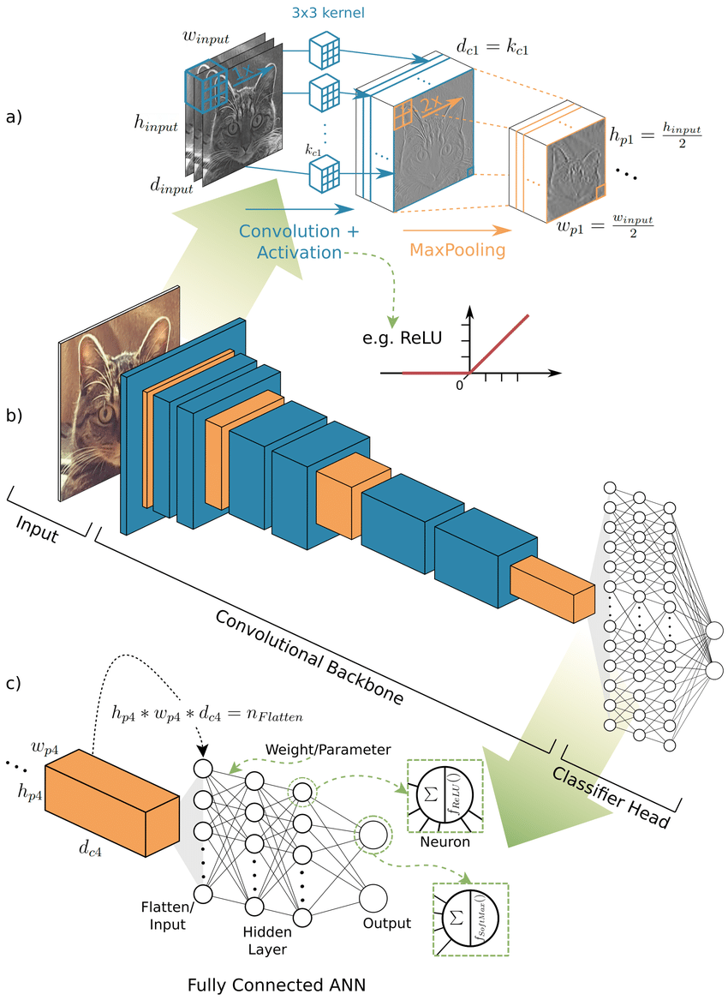
</div>

---

### 🛠️ **Arsitektur Convolutional Backnone**

#### **1. Convolution Layer**

Convolutional layer melakukan konvolusi terhadap citra input dengan *filter* untuk menghasilkan `feature map` 🌌. `Feature map` menyimpan informasi penting dari gambar yang jauh lebih esensial dibandingkan gambar mentah.

<div align="center">
    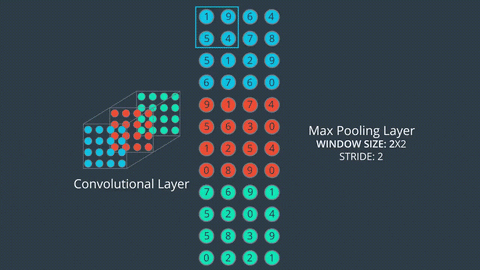
</div>

Proses konvolusi dilakukan dengan **sliding filter** dari kiri atas hingga kanan bawah matriks citra. 

<div align="center">
    
</div>

Convolutional layer akan menemukan *kernel* atau *weight* yang optimal. Semakin banyak *kernel*, semakin kaya fitur yang diekstrak 🧩. Penumpukan layer konvolusi memungkinkan informasi menjadi lebih bermakna dan berlapis.

<div align="center">
    
    
</div>
<div align="center">
    
    
</div>

```python
tf.keras.layers.Conv2D(
    filters,          # Dimensi ruang output → jumlah filter output
    kernel_size,      # Ukuran spasial filter (lebar/tinggi)
    strides=(1, 1),   # Besar pergeseran filter dalam konvolusi
    padding='valid',  # Jumlah padding → 'valid' tidak ada padding
    activation=None,  # Fungsi aktivasi yang digunakan
    input_shape=(height, width, color_channels)  # Input gambar
)
```

- filters → dimensi ruang output → jumlah filter output dalam konvolusi
- kernel_size → ukuran spasial dari filter (lebar/tinggi)
- stride → besar pergeseran filter dalam konvolusi
- padding → jumlah penambahan nol pada gambar
    - valid → tidak ada padding
    - same → padding nol merata kiri/kanan/atas/bawah
- activation → fungsi aktivasi untuk digunakan
- input_shape → input gambar

#### **2. Batch Normalization**

⚙️ Batch Normalization berfungsi untuk mengurangi *covariance shift* dengan menormalkan distribusi setiap nilai input yang berubah selama pelatihan 🔄. Hal ini membuat pelatihan lebih stabil dan cepat.

<div align="center"> 
     
</div>

```python
tf.keras.layers.BatchNormalization()
```

#### **3. Pooling Layer**

Pooling layer digunakan untuk mengurangi dimensi citra fitur (downsampling) sambil mempertahankan informasi penting 🗜️.

<div align="center"> 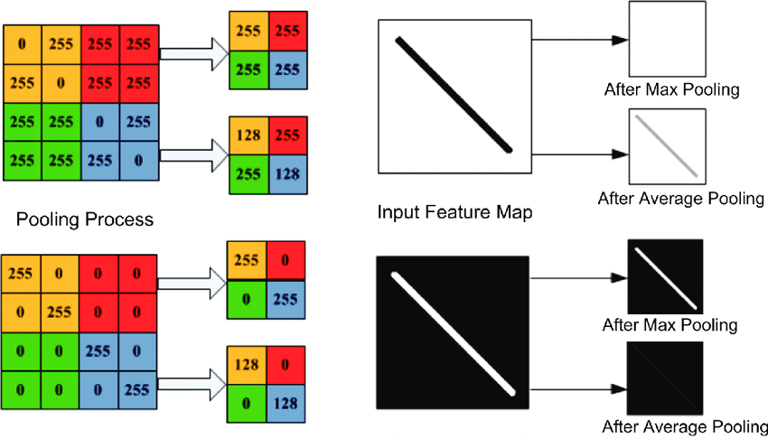 </div> <div align="center"> 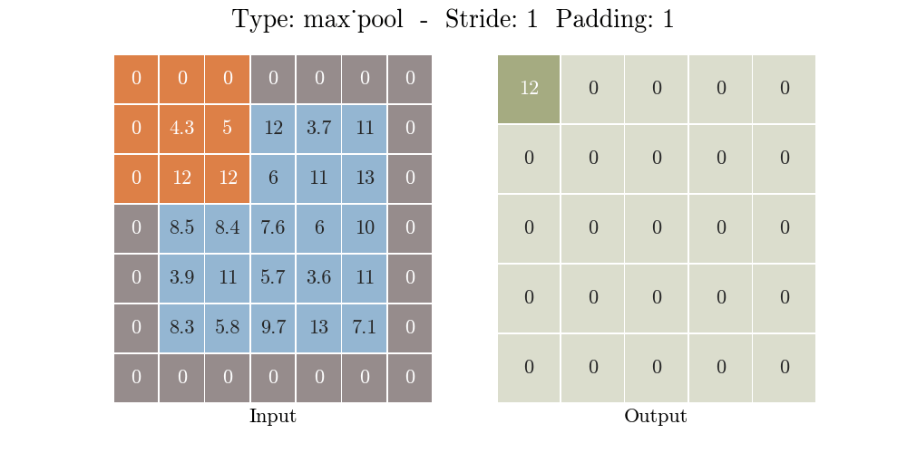 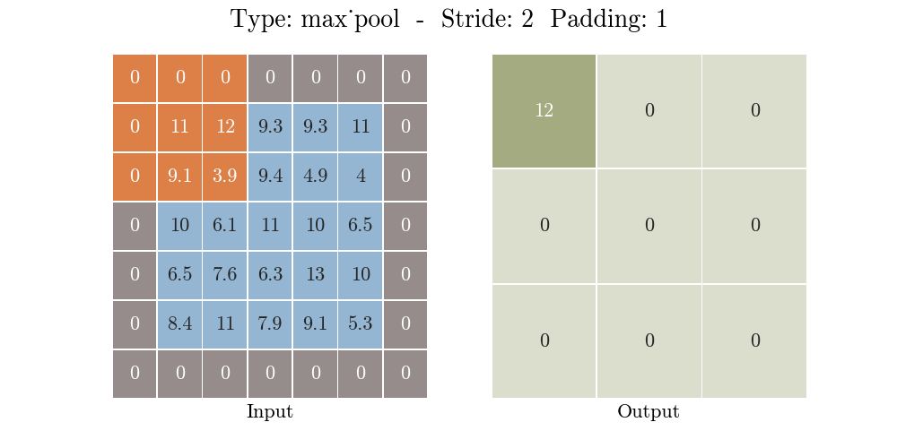 </div>

```python
tf.keras.layers.MaxPool2D(
    pool_size=(2, 2),
    strides=None,
    padding='same',
)
```

```python
tf.keras.layers.AveragePooling2D(
    pool_size=(2, 2),
    strides=None,
    padding='same',
)
```

- pool_size → ukuran pool
- strides → besar pergeseran
- padding → jumlah penambahan nol pada gambar
    - valid → tidak ada padding
    - same → padding nol merata kiri/kanan/atas/bawah

### **🎨 Visualisasi Proses Konvolusi dan Pooling pada Gambar**

Contoh berikut menunjukkan bagaimana gambar anjing diproses setelah melewati Convolutional Backbone yang terdiri dari beberapa convolution layer dan max pooling layer. Terlihat pada gambar bahwa fitur-fitur penting pada wajah anjing mulai muncul setelah beberapa lapisan konvolusi dan pooling. Proses ini membantu model mengenali dan memprediksi gambar dengan lebih baik 📈.

<div align="center"> 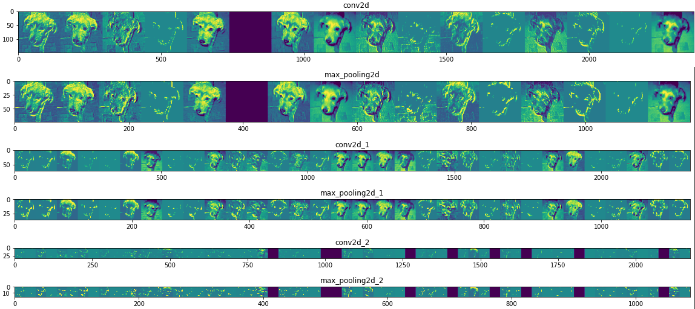 </div> <br>

### 🛠️ **Arsitektur Classifier Head**

<div align="center">
    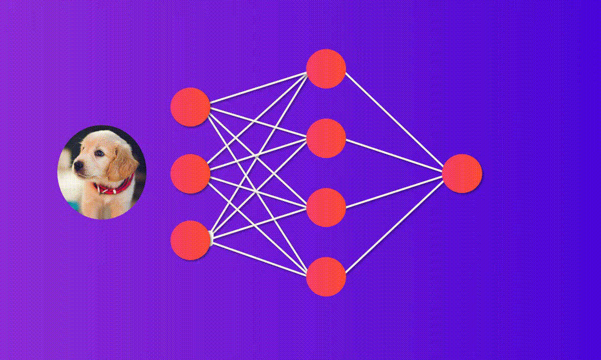
</div>

#### **1. Flatten dan Global Pooling**

Flatten dan Global Pooling berperan sebagai `input layer`.

<div align="center">
    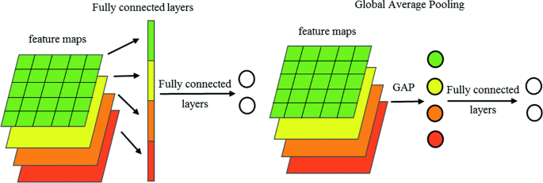
</div>

- Flatten → height * width * depth (1 dimension)

    ```python
    tf.keras.layers.Flatten()
    ```

- Global Pooling -> d (1 dimension)

    ```python
    tf.keras.layers.GlobalAveragePooling2D()
    ```

    ```python
    tf.keras.layers.GlobalMaxPool2D()
    ```

#### **2. Hidden Layer**

```python
tf.keras.layers.Dense(units, activation=None)
```

- units → dimensi ruang output
- activation → fungsi aktivasi untuk digunakan → relu

#### **3. Output Layer**

Jumlah neuron disesuaikan dengan permasalahan yang dihadapi.

- Untuk klasifikasi `binary dan regresi`, output layer terdiri dari `satu neuron`.
- Untuk klasifikasi `multiclass atau categorical`, output layer terdiri dari jumlah neuron yang sama dengan `jumlah class`.


    ```python
    tf.keras.layers.Dense(units, activation=None)
    ```

    - units → dimensi ruang output
        - binary → satu neuron.
        - categorical → jumlah neuron sesuai dengan jumlah kelas.
    - activation → fungsi aktivasi untuk digunakan

        | activation | output/class mode | loss function                             |
        | ---------- | ----------------- | ----------------------------------------- |
        | sigmoid    | binary            | binary_crossentropy → 0/1                 |
        | softmax    | categorical       | categorical_crossentropy → [1 0] [0 1]    |
        | softmax    | categorical       | sparse_categorical_crossentropy → [0] [1] |

<br>

## **🎯Strategi Proses Training**

<div align="center">
    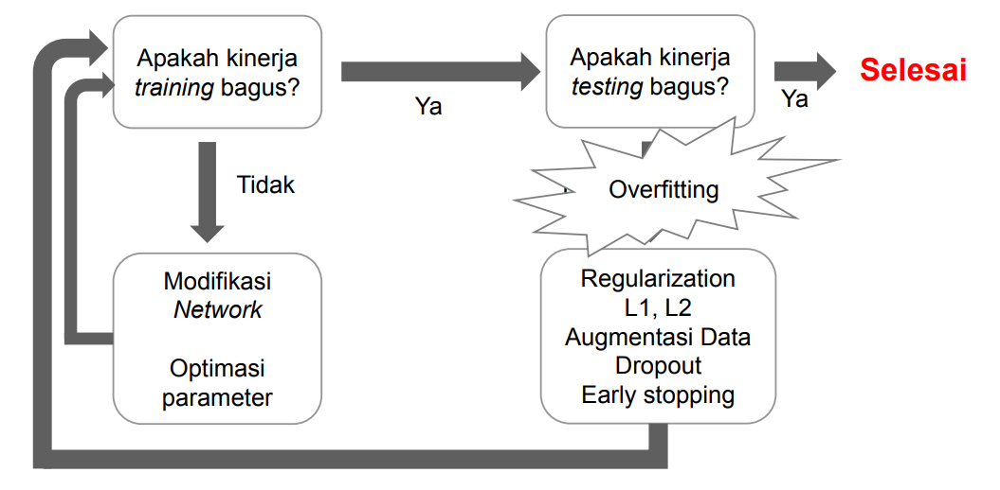
</div>

### **1. Modifikasi Network**

- Merubah arsitektur, misalnya menambah jumlah hidden layer, jumlah neuron, atau jenis arsitektur lain.

    <div align="center">
        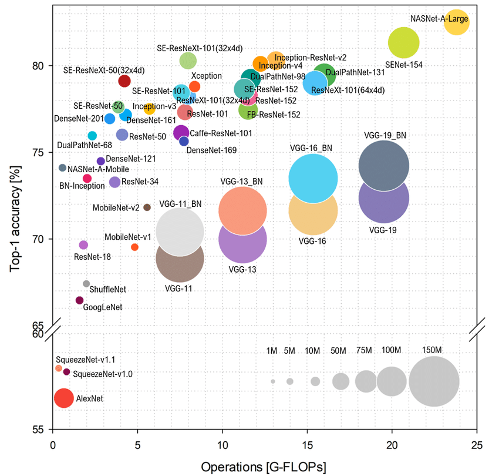
    </div>

- Merubah fungsi aktivasi, misalnya menggunakan ReLU (apabila x ≤ 0 maka x = 0 dan apabila x > 0 maka x = x).

    <div align="center">
        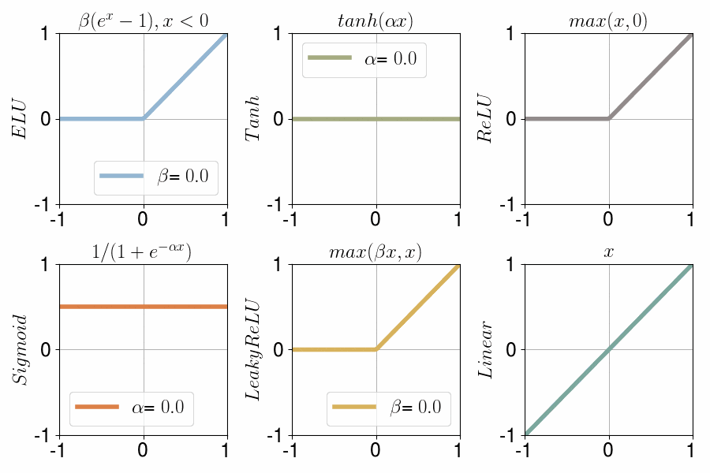
        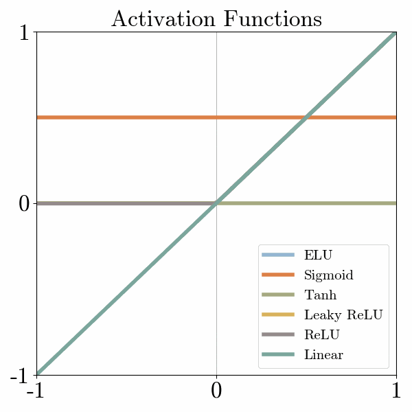
    </div>

### **2. [Optimasi parameter](https://www.tensorflow.org/api_docs/python/tf/keras/optimizers?version=nightly)**

Nilai learning rate berpengaruh pada perhitungan bobot baru, umumnya penggunaan learning rate yang menyesuaikan nilai gradien (adaptive learning rate) menunjukkan kinerja model yang lebih baik. Contoh algoritma adaptive learning rate seperti `Adagrad`, `Adadelta`, `Adam`, `AdaSecant`, dan `RMSprop`.

### **3. Mencegah Overfitting**

- Regularisasi dilakukan untuk mengurangi generalization error dengan mencegah model lebih kompleks.
    - [Regularization L1 norm dan Regularization L2](https://www.tensorflow.org/api_docs/python/tf/keras/regularizers) norm (weight decay)
    ```python
    tf.keras.regularizers.L1(rate)
    ```
- [Dropout](https://www.tensorflow.org/api_docs/python/tf/keras/layers/Dropout) adalah proses mencegah terjadinya overfitting dan juga mempercepat proses learning.

    <div align="center">
        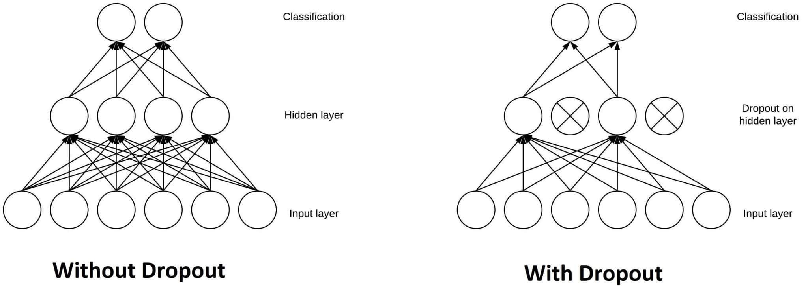
    </div>

    ```python
    tf.keras.layers.Dropout(rate)
    ```

- [Early Stopping](https://www.tensorflow.org/api_docs/python/tf/keras/callbacks/EarlyStopping) adalah iterasi pada saat training dihentikan jika `generalization error/loss validation` mulai naik.
    ```python
    early_stopping = tf.keras.callbacks.EarlyStopping(monitor='val_loss', patience=3)
    ```

- Augmentasi Data adalah menambah data training. Augmentasi data dapat dilakukan dengan menggunakan [Image Data Generator](https://www.tensorflow.org/api_docs/python/tf/keras/preprocessing/image/ImageDataGenerator).

<h2 align="center">Keperluan Hands On</h2>

- Code : [**CNN Image Classification**](https://www.kaggle.com/code/raihanradhityas/transfer-learning-week-4-cnn-image-classification)
