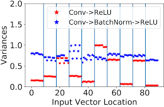

## **Convolutional Neural Network**

### **Definisi Convolutional Neural Network**

Convolutional Neural Network (CNN/ConvNet) merupakan bagian dari deep neural network, yakni jenis jaringan saraf tiruan yang umumnya digunakan dalam pengenalan dan pemrosesan gambar. Algoritma ini memiliki dua bagian utama yaitu bagian ekstraksi fitur dan bagian klasifikasi. Bagian ekstraksi fitur gambar dilakukan oleh Convolutional Backbone, sedangkan untuk bagian klasifikasi dilakukan oleh Classifier Head yang berisi Artificial Neural Network.

<div align="center">
    
</div>

### **Arsitektur Convolutional Neural Network**

#### **1. Convolution Layer**

Convolutional layer merupakan proses konvolusi citra input dengan filter yang menghasilkan `feature map` (fitur-fitur penting sebuah gambar memberikan informasi jauh lebih besar dibanding gambar input itu sendiri).

<div align="center">
    
</div>

Proses konvolusi citra dengan filter dilakukan `sliding filter` mulai dari kiri atas dari matrik citra sampai kanan bawah.

<div align="center">
    
</div>

Convolutional layer akan mencari kernel/weight yang tepat. Semakin banyak kernel maka semakin banyak jenis fitur. Tujuan Convolutional layer ditumpuk agar informasi yang didapatkan semakin lebih bermakna.

<div align="center">
    
    
</div>
<div align="center">
    
    
</div>

```python
tf.keras.layers.Conv2D(
    filters,
    kernel_size,
    strides=(1, 1),
    padding='valid',
    activation=None,
    input_shape=(height, width, color_channels)
)
```

- filters → dimensi ruang output → jumlah filter output dalam konvolusi
- kernel_size → ukuran spasial dari filter (lebar/tinggi)
- stride → besar pergeseran filter dalam konvolusi
- padding → jumlah penambahan nol pada gambar
    - valid → tidak ada padding
    - same → padding nol merata kiri/kanan/atas/bawah
- activation → fungsi aktivasi untuk digunakan
- input_shape → input gambar

#### **2. Batch Normalization**

Batch Normalization berperan untuk mengurangi pergeseran kovarian atau menyamakan distribusi setiap nilai input yang selalau berubah karena perubahan pada layer sebelumnya selama proses training.

<div align="center">
    
</div>

```python
tf.keras.layers.BatchNormalization()
```

#### **3. Pooling Layer**

Pooling layer berperan untuk memperkecil dimensi feature image (downsampling) dan menyimpan informasi penting.

<div align="center">
    
</div>

<div align="center">
    
    
</div>

```python
tf.keras.layers.MaxPool2D(
    pool_size=(2, 2),
    strides=None,
    padding='same',
)
```

```python
tf.keras.layers.AveragePooling2D(
    pool_size=(2, 2),
    strides=None,
    padding='same',
)
```

- pool_size → ukuran pool
- strides → besar pergeseran
- padding → jumlah penambahan nol pada gambar
    - valid → tidak ada padding
    - same → padding nol merata kiri/kanan/atas/bawah

### **Visualisasi Proses Konvolusi dan Pooling pada Gambar**

Berikut adalah salah satu contoh bagaimana gambar anjing diproses setelah melewati Convolutional Backbone yang terdiri dari beberapa convolution layer dan max pooling layer. Terlihat pada gambar, fitur-fitur penting pada wajah anjing akan semakin muncul setelah dilakukan proses konvolusi dan pooling. Proses ini akan mempermudah model dalam mengenali gambar yang akan dilatih dan diprediksi nantinya.

<div align="center">
    
</div>

<br>