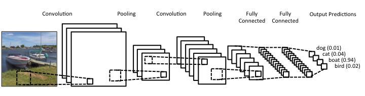

<h1 align="center"> 🌐 Deep Learning 🚀 </h1>

<p align="center">
    
</p>

<p align="center">
    
    
    
    
    

</p>

# Pengantar Deep Learning 🌟

<p align="center">
    
</p>

**Deep Learning** adalah salah satu cabang dari **Artificial Intelligence (AI)** yang meniru cara kerja otak manusia dalam memproses data dan membuat keputusan. Menggunakan struktur yang dikenal sebagai **neural networks**, deep learning memungkinkan komputer untuk belajar dari sejumlah besar data dengan cara yang menyerupai pola pembelajaran manusia.

## 🔍 Pentingnya Deep Learning dalam AI

Deep learning telah menjadi pilar penting dalam pengembangan teknologi AI karena kemampuannya untuk:

- **📊Mengolah Data Kompleks**: Deep learning unggul dalam memahami pola dalam data yang besar dan kompleks, seperti gambar, suara, dan teks.
- **🤖Mengotomatisasi Tugas Kompleks**: Dengan model deep learning, AI dapat menjalankan tugas yang sebelumnya sulit untuk diotomatisasi, seperti memahami bahasa alami atau mengenali objek dalam gambar.
- **🎯Memberikan Akurasi Tinggi**: Dalam berbagai tugas, seperti klasifikasi gambar dan prediksi, deep learning sering kali mencapai tingkat akurasi yang lebih tinggi dibandingkan metode machine learning tradisional.

## 🌐Aplikasi Utama Deep Learning

Deep learning telah membuka jalan bagi berbagai inovasi dan aplikasi di dunia nyata, seperti:

- **🖼️Computer Vision**: Penggunaan deep learning dalam pengenalan objek, deteksi wajah, analisis video, dan diagnosis medis melalui citra medis.
- **📝Natural Language Processing (NLP)**: Teknologi ini digunakan untuk analisis teks, chatbot, penerjemahan otomatis, dan asisten virtual.
- **🎙️Speech Recognition**: Mengubah suara menjadi teks, seperti yang digunakan dalam perangkat pintar atau sistem call center otomatis.
- **🛍️Rekomendasi Produk**: Digunakan di e-commerce dan platform hiburan (seperti Netflix dan Spotify) untuk memberikan rekomendasi produk atau konten yang relevan kepada pengguna.
- **🚗Kendaraan Otonom**: Deep learning digunakan dalam pemrosesan gambar dan data sensor di mobil otonom untuk membantu mereka mengidentifikasi jalan, pejalan kaki, dan rambu lalu lintas.

Dengan perkembangan teknologi dan meningkatnya volume data, deep learning terus menjadi alat yang semakin kuat dan relevan dalam kehidupan sehari-hari dan berbagai industri.

## 🧠 Artificial Neural Network (ANN)

<p align="center">
    
</p>

**Neural Network**, yang juga disebut **Jaringan Saraf Tiruan (JST)** atau **Artificial Neural Network (ANN)**, adalah model algoritma yang terinspirasi oleh struktur dan fungsi jaringan saraf biologis dalam otak hewan (termasuk manusia). ANN meniru cara kerja neuron biologis dalam memproses informasi, di mana neuron-neuron ini bekerja sama untuk memecahkan berbagai masalah kompleks.

## Arsitektur Artificial Neural Network (ANN) 🧩

<p align="center">
    
</p>

Sebuah ANN terdiri dari unit-unit atau node-node yang saling terhubung yang disebut neuron buatan atau artificial neuron, yang secara teori meniru neuron-neuron di otak. Node-node ini dihubungkan oleh tepi-tepi (edges), yang meniru sinapsis di otak. Setiap neuron buatan menerima sinyal dari neuron-neuron yang terhubung, kemudian memprosesnya dan mengirimkan sinyal ke neuron-neuron lain yang terhubung. "Sinyal" tersebut adalah bilangan riil, dan keluaran dari setiap neuron dihitung oleh suatu fungsi non-linear dari jumlah inputnya, yang disebut fungsi aktivasi (activation function). Kekuatan sinyal di setiap koneksi ditentukan oleh sebuah bobot (weight), yang disesuaikan selama proses pembelajaran.

<p align="center">
    
</p>

Biasanya, neuron-neuron dikelompokkan ke dalam lapisan-lapisan. Lapisan-lapisan yang berbeda mungkin melakukan transformasi yang berbeda pada input mereka. Sinyal-sinyal bergerak dari lapisan pertama (lapisan input) ke lapisan terakhir (lapisan output), dan mungkin melewati beberapa lapisan antara (lapisan tersembunyi) yang disebut hidden layer. Suatu jaringan disebut deep neural network jika memiliki setidaknya dua hidden layer.

### **🔹Input Layer**

Lapisan input dari ANN terdiri dari neuron-neuron input yang membawa data awal ke dalam sistem untuk diproses lebih lanjut oleh lapisan-lapisan artificial neuron berikutnya. Lapisan input adalah awal dari alur kerja untuk ANN. Jumlah neuron input sama dengan jumlah fitur pada data input.

```python
tf.keras.Input(shape=[height, width, color_channels])
```

```python
tf.keras.layers.InputLayer(input_shape=(height, width, color_channels))
```

```python
tf.keras.layers.Flatten(input_shape=(height, width, color_channels))
```

- input_shape/shape → dimensi ruang input

### **🔹Hidden Layer**

Dalam Artificial Neural Network (ANN), `hidden layer` adalah lapisan neuron buatan yang dapat ditambahkan atau diterapkan dalam rancangan. Lapisan ini bukanlah lapisan input maupun lapisan output, lapisan ini berada di antara keduanya. Contoh dari ANN yang menggunakan hidden layer adalah `feedforward neural network`.

Hidden layer mengubah input dari lapisan input ke lapisan output. Dilakukan dengan cara menerapkan `weight` pada input dan melewatkannya melalui `activation function`, yang menghitung output berdasarkan input dan bobot tersebut. Proses ini memungkinkan ANN untuk mempelajari hubungan non-linear antara data input dan output. Bobot pada input dapat ditetapkan secara acak, dan juga dapat disesuaikan serta dikalibrasi melalui metode yang disebut `backpropagation`. Jumlah lapisan tersembunyi sebaiknya disesuaikan dengan kompleksitas permasalahan yang dihadapi.

- Semakin banyak jumlah lapisan (layer), semakin banyak waktu komputasi yang dibutuhkan.
- Semakin banyak jumlah node (neuron), semakin memungkinkan ANN untuk mempelajari pola yang lebih rumit.
- Untuk mencegah `overfitting`, jumlah node (neuron) sebaiknya ditambahkan secara bertahap.

    ```python
    tf.keras.layers.Dense(units, activation='relu')
    ```

    - units → dimensi ruang output
    - activation → fungsi aktivasi untuk digunakan, misalnya ReLu

### **🔹Output Layer**

Lapisan output pada artificial neural network adalah lapisan terakhir yang menghasilkan prediksi atau hasil akhir dari model. Lapisan ini menerima input dari hidden layer sebelumnya, mengolahnya, dan mengeluarkan hasil yang digunakan untuk menentukan keputusan atau klasifikasi akhir. Jumlah neuron disesuaikan dengan permasalahan yang dihadapi.

- Untuk klasifikasi `binary dan regresi`, output layer terdiri dari `satu neuron`.
- Untuk klasifikasi `multiclass atau categorical`, output layer terdiri dari jumlah neuron yang sama dengan `jumlah class`.

    ```python
    tf.keras.layers.Dense(units, activation='sigmoid')
    ```

    - units → dimensi ruang output
        - binary → satu neuron.
        - categorical → jumlah neuron sesuai jumlah class
    - activation → fungsi aktivasi yang digunakan

        | activation | output/class mode | loss function                             |
        | ---------- | ----------------- | ----------------------------------------- |
        | sigmoid    | binary            | binary_crossentropy → 0/1                 |
        | softmax    | categorical       | categorical_crossentropy → [1 0] [0 1]    |
        | softmax    | categorical       | sparse_categorical_crossentropy → [0] [1] |

Artificial Neural Network digunakan untuk berbagai tugas, termasuk pemodelan prediktif, kontrol adaptif, dan pemecahan masalah dalam kecerdasan buatan. Artificial Neural Network dapat belajar dari pengalaman, dan dapat menarik kesimpulan dari kumpulan informasi yang kompleks.

## Jenis-Jenis Artificial Neural Network 🧬

### Feedforward Neural Networks (FNNs) ➡️

<p align="center">
    
</p>

**Feedforward Neural Networks (FNNs)** adalah tipe neural network yang paling sederhana. Data mengalir hanya dalam satu arah, dari lapisan input ke lapisan output, melewati hidden layer (jika ada) tanpa adanya aliran balik (feedback loop). FNN cocok untuk tugas klasifikasi dan regresi dasar, di mana hubungan antara input dan output bersifat langsung tanpa mempertimbangkan urutan waktu.

- **💡Contoh Penggunaan**: FNN dapat digunakan dalam pengenalan pola sederhana seperti klasifikasi gambar statis atau untuk memprediksi nilai berkelanjutan seperti harga berdasarkan fitur tertentu.

- **⚠️Keterbatasan**: Karena tidak memiliki mekanisme untuk menangani data berurutan, FNN tidak cocok untuk aplikasi yang membutuhkan konteks waktu atau urutan data.

```python
# Contoh FNN menggunakan TensorFlow
model = tf.keras.Sequential([
    tf.keras.layers.Dense(128, activation='relu'),
    tf.keras.layers.Dense(10, activation='softmax')
])
```
### Convolutional Neural Networks (CNNs) 🖼️

<p align="center">
    
</p>

**Convolutional Neural Networks (CNNs)** adalah jaringan yang dirancang khusus untuk memproses data yang memiliki struktur grid, seperti gambar atau video. CNN menggunakan lapisan konvolusi untuk melakukan operasi pada patch-patch kecil dalam gambar, yang memungkinkan mereka menangkap fitur-fitur seperti tepi, tekstur, dan objek kompleks dengan efisiensi tinggi.

- **Lapisan Utama dalam CNN**:
    - **🔍Convolutional Layer**: Menerapkan filter (kernel) pada input untuk mengekstrak fitur penting. Filter ini bergerak (melakukan convolusi) di seluruh gambar untuk mengenali pola.
    - **🔄Pooling Layer**: Menyederhanakan data dengan mengurangi dimensi dan fokus pada fitur-fitur dominan melalui teknik seperti max pooling.
    - **📏Fully Connected Layer**: Menyambungkan hasil dari lapisan sebelumnya ke lapisan output untuk klasifikasi atau regresi.
- **Contoh Penggunaan**: CNN sering digunakan dalam aplikasi computer vision seperti klasifikasi citra, deteksi objek, pengenalan wajah, dan diagnosis medis berbasis citra.
- **Kelebihan CNN**: CNN mampu mengenali pola pada gambar meskipun terjadi rotasi, pergeseran, atau perubahan ukuran objek.

```python
# Contoh CNN menggunakan TensorFlow
model = tf.keras.Sequential([
    tf.keras.layers.Conv2D(32, (3, 3), activation='relu', input_shape=(64, 64, 3)),
    tf.keras.layers.MaxPooling2D(2, 2),
    tf.keras.layers.Flatten(),
    tf.keras.layers.Dense(128, activation='relu'),
    tf.keras.layers.Dense(10, activation='softmax')
])
```

### Recurrent Neural Networks (RNNs) 🔄
<p align="center">
    
</p>

**Recurrent Neural Networks (RNNs)** adalah tipe neural network yang cocok untuk data berurutan, seperti teks, data waktu, dan audio. Tidak seperti FNN, RNN memiliki “memori” internal melalui loop pada neuron, yang memungkinkan informasi sebelumnya disimpan dan digunakan dalam prediksi saat ini. Hal ini memungkinkan RNN mempertimbangkan urutan data atau konteks waktu.

- **Lapisan Utama dalam RNN**:
    - **Recurrent Layer**: Memproses setiap elemen dalam urutan secara bertahap, dengan menyimpan informasi dari langkah-langkah sebelumnya. Setiap neuron berulang kali memproses input saat ini dan informasi yang disimpan.
    - **Hidden State**: Menyimpan hasil komputasi dari satu waktu ke waktu berikutnya dalam urutan data.
- **Varian RNN**:
    - **⏱️LSTM (Long Short-Term Memory)**: RNN yang dirancang untuk menangani data dengan ketergantungan jangka panjang dengan menggunakan tiga jenis “gate” (input, output, dan forget gate).
    - **🚪GRU (Gated Recurrent Unit)**: Mirip dengan LSTM tetapi memiliki struktur yang lebih sederhana, cocok untuk aplikasi yang membutuhkan perhitungan lebih cepat.
- **Contoh Penggunaan**: RNN dan variannya digunakan untuk aplikasi yang melibatkan urutan, seperti pengenalan ucapan, analisis sentimen dalam teks, prediksi pasar saham, dan terjemahan bahasa otomatis.

```python
# Contoh RNN menggunakan TensorFlow
model = tf.keras.Sequential([
    tf.keras.layers.Embedding(input_dim=1000, output_dim=64),
    tf.keras.layers.SimpleRNN(128),
    tf.keras.layers.Dense(1, activation='sigmoid')
])
```

<br>
